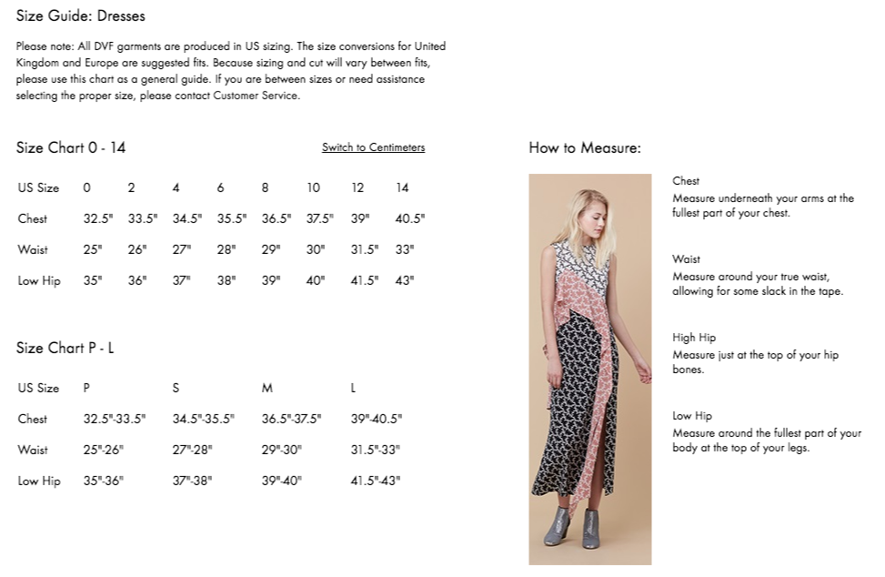
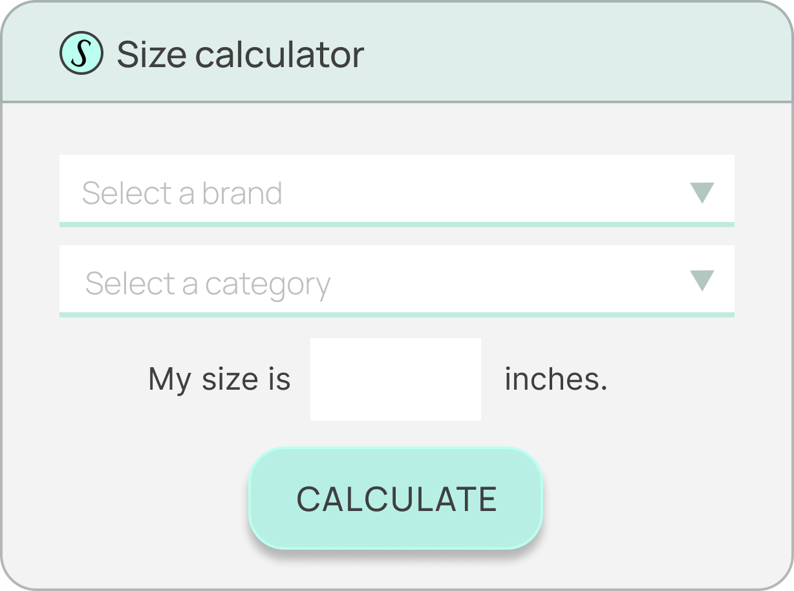
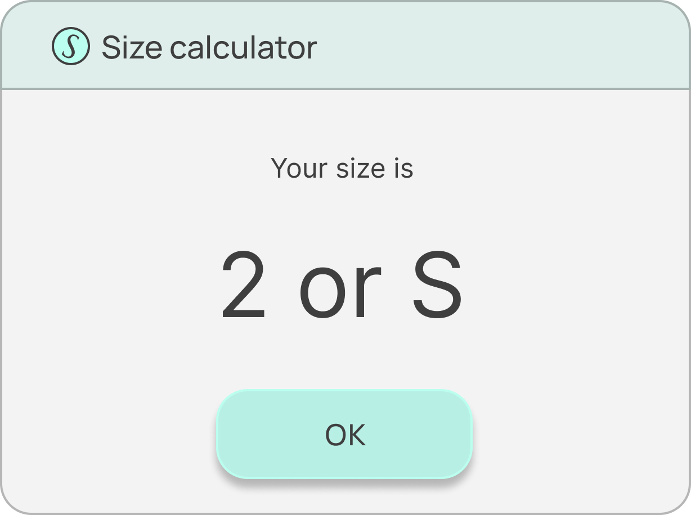

# Secret Sauce Size Calculator

Calculate your size with ease!

## Background

Apparel and footwear sizing is quite inconsistent and there can be great
differences between brands. Size charts can help navigate the landscape when
shopping online.

Understanding size charts can be a challenge. The Secret Sauce Size Calculator
was born to address this. The calculator helps users by suggesting their best
fitting sizes based on their body measurements.

Sizing varies across brands and categories. The calculator is meant to be a
standalone tool which means users must pick a brand and a category for which
they want to see a size recommendation.

There can be multiple sizes that match their body measurements. Different
products use different size labels. It can happen that within the same
brand and category some products use numeric labels (2, 4, 6, 8, 10) and
some use alpha labels (XS, S, M, L, XL).

### Size charts

An example size chart looks like the following:



The above size chart describes sizes for Diane von Furstenberg dresses.
There are multiple body measurements but a single dominant measurement can
be used to calculate your best fitting size. This measurement is different for
different categories. For example bust/chest can be used for dresses and tops
while hip/waist works for bottoms such as pants or jeans.

## Task

Create an application that allows users to calculate their sizes.

The application should look exactly like the following:

Main screen: 

Suggested size screen: 

Additionally you can find the same design on
[Figma](https://www.figma.com/file/0mvO5viOpngFpdnCKs569l/homework-design).

You can find the necessary assets in the `assets/` directory.

Your task is to implement an application that allows the user to complete the
form and get size recommendations. The necessary inputs are the following:

1. Brand. The calculator supports hundreds of brands so `/brands` endpoint is
   paginated or can be filtered using the `name_prefix` parameter.
2. Category. There are only a handful of categories for any brand.
3. Body measurement. This is a single value that describes the dominant
   measurement for the selected category.

After completing the form the user must be presented with the suggested size
labels. The API can return multiple results.

### Size Calculator API

A service for size suggestions is available at
https://size-calculator-api.sspinc.io. The API provides all the necessary
endpoints such as listing brands and categories and calculating size
suggestions. The Swagger specification for the API is available on the
aforementioned address. You will need your username and API key to access it.

The API uses [HTTP Basic authentication][basic-auth].

### Example request using fetch()

```js
var username = "<your username>";
var apiKey = "<your api key>";
var promise = fetch('https://size-calculator-api.sspinc.io/brands', {
    mode: 'cors',
    credentials: 'include',
    method: 'GET',
    headers: {
        'Authorization': 'Basic ' + btoa(`${username}:${apiKey}`)
    }
})

promise
    .then((response) => response.json())
    .then((data) => console.log(data))
```

### Technology

For the programming language JavaScript and TypeScript are our preferred
choices. There is no preferred framework use whatever is the most comfortable
for you.

## Submitting your work

1. Fork this repository
2. Commit your changes to your local repository
3. Push changes to your fork
4. *DO NOT* open a pull request
5. Reply to our email with a link to your GitHub repository

[basic-auth]: https://developer.mozilla.org/en-US/docs/Web/HTTP/Authentication


# Getting Started with Create React App

This project was bootstrapped with [Create React App](https://github.com/facebook/create-react-app).

## Available Scripts

In the project directory, you can run:

### `npm start`

Runs the app in the development mode.\
Open [http://localhost:3000](http://localhost:3000) to view it in your browser.

The page will reload when you make changes.\
You may also see any lint errors in the console.

### `npm test`

Launches the test runner in the interactive watch mode.\
See the section about [running tests](https://facebook.github.io/create-react-app/docs/running-tests) for more information.

### `npm run build`

Builds the app for production to the `build` folder.\
It correctly bundles React in production mode and optimizes the build for the best performance.

The build is minified and the filenames include the hashes.\
Your app is ready to be deployed!

See the section about [deployment](https://facebook.github.io/create-react-app/docs/deployment) for more information.

### `npm run eject`

**Note: this is a one-way operation. Once you `eject`, you can't go back!**

If you aren't satisfied with the build tool and configuration choices, you can `eject` at any time. This command will remove the single build dependency from your project.

Instead, it will copy all the configuration files and the transitive dependencies (webpack, Babel, ESLint, etc) right into your project so you have full control over them. All of the commands except `eject` will still work, but they will point to the copied scripts so you can tweak them. At this point you're on your own.

You don't have to ever use `eject`. The curated feature set is suitable for small and middle deployments, and you shouldn't feel obligated to use this feature. However we understand that this tool wouldn't be useful if you couldn't customize it when you are ready for it.

## Learn More

You can learn more in the [Create React App documentation](https://facebook.github.io/create-react-app/docs/getting-started).

To learn React, check out the [React documentation](https://reactjs.org/).

### Code Splitting

This section has moved here: [https://facebook.github.io/create-react-app/docs/code-splitting](https://facebook.github.io/create-react-app/docs/code-splitting)

### Analyzing the Bundle Size

This section has moved here: [https://facebook.github.io/create-react-app/docs/analyzing-the-bundle-size](https://facebook.github.io/create-react-app/docs/analyzing-the-bundle-size)

### Making a Progressive Web App

This section has moved here: [https://facebook.github.io/create-react-app/docs/making-a-progressive-web-app](https://facebook.github.io/create-react-app/docs/making-a-progressive-web-app)

### Advanced Configuration

This section has moved here: [https://facebook.github.io/create-react-app/docs/advanced-configuration](https://facebook.github.io/create-react-app/docs/advanced-configuration)

### Deployment

This section has moved here: [https://facebook.github.io/create-react-app/docs/deployment](https://facebook.github.io/create-react-app/docs/deployment)

### `npm run build` fails to minify

This section has moved here: [https://facebook.github.io/create-react-app/docs/troubleshooting#npm-run-build-fails-to-minify](https://facebook.github.io/create-react-app/docs/troubleshooting#npm-run-build-fails-to-minify)
